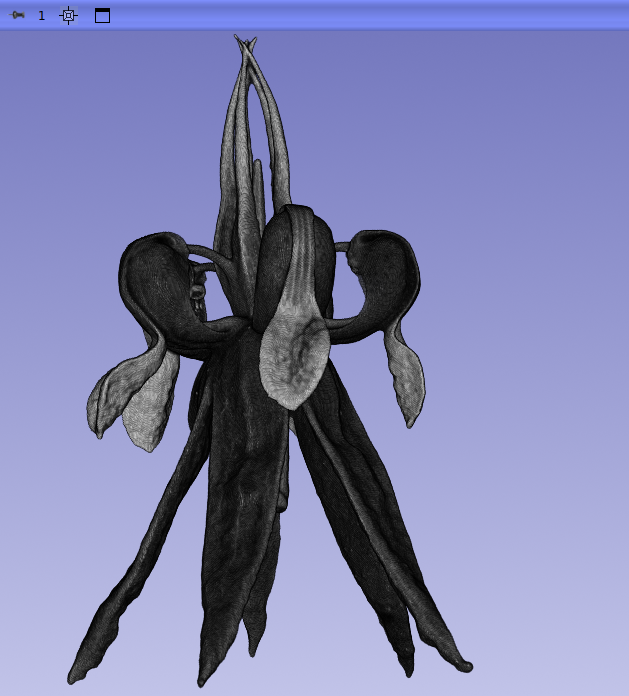
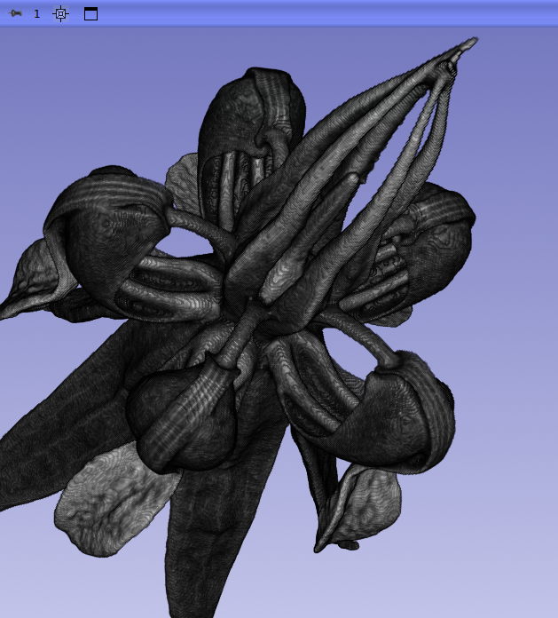

## MorphoDepot Repository
Repository for segmentation of a specimen scan.  See [this JSON file](MorphoDepotAccession.json) for specimen details.
* Species: Theobroma cacao
* Modality: Micro CT (or synchrotron)
* Contrast: Yes
* Dimensions: (627, 687, 957)
* Spacing (mm): (0.0205306, 0.0205306, 0.0205306)

## Screenshots

   
_flower volume masked with whole flower segmentation; view from side_

   
_flower volume masked with whole flower segmentation; view from apex_

## Data availability statement
Original micro-CT data is available on MorphoSource.org @ [ark:/87602/m4/500005](https://n2t.net/ark:/87602/m4/500005). Surface model available on Sketchfab @ [https://skfb.ly/puvvK](https://skfb.ly/puvvK). Landmarks for geometric morphometric analysis available on Zenodo @ [https://doi.org/10.5281/zenodo.15107026](https://doi.org/10.5281/zenodo.15107026). Full micro-CT scanning parameters available on Scholarship.Miami.Edu Thesis Portal @ [Appendix S2-2](https://scholarship.miami.edu/esploro/outputs/doctoral/Morphology-30---3D-Pollination-Biology/991032663736302976#file-3).

## References
Wolcott et al. 2023. 3D pollination biology using micro‐computed tomography and geometric morphometrics in *Theobroma cacao*. Applications in Plant Sciences. [DOI](https://doi.org/10.1002/aps3.11549)
